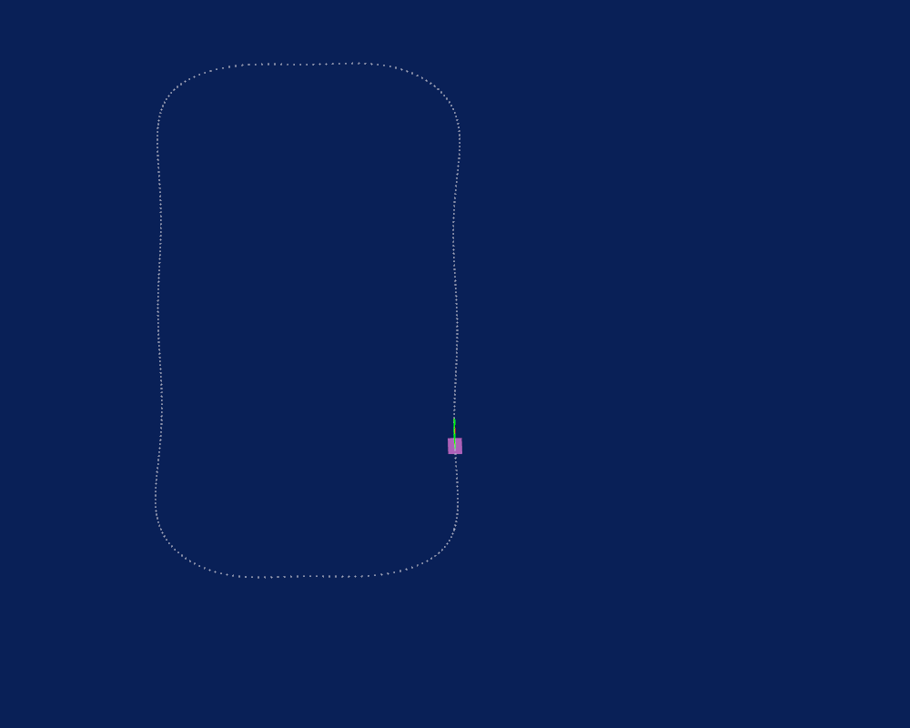

# multisurface-racing

## Simulator
This repository is using multi-body full scale car version of the [F1/10 gym](https://github.com/atomyks/f1tenth_gym/tree/multibody).

## Contributions
- This repo create a MPCC framework for the dynamic model of autonomous racing cars by using Casadi interface.

- Comparison between PaIL-based MPCC and standard MPCC for autonomous racing car.

